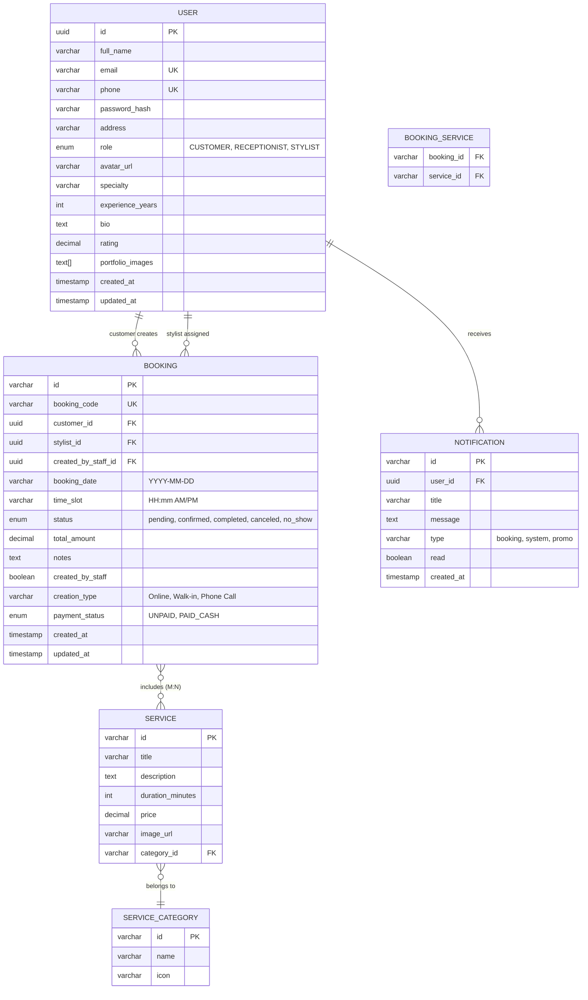

# Tài Liệu Chuyển Giao Front-End → Back-End (Java Spring Boot + PostgreSQL)

> **Phiên bản**: v2.0 — Đã kiểm tra đối chiếu toàn bộ source code TSX  
> **Ngày cập nhật**: 2026-08-15  
> **Stack**: React Native (TypeScript) ↔ Java Spring Boot ↔ PostgreSQL

---

## 1. Tổng Quan Kiến Trúc Tệp Tin (Complete File Map)

### 1.1. Cấu trúc thư mục `src/`

```
src/
├── components/              # 3 Reusable UI components
│   ├── CustomAppbar.tsx       → Thanh tiêu đề tùy chỉnh (title, subtitle, back, actions)
│   ├── EmptyState.tsx         → Placeholder hiển thị khi danh sách trống (icon, title, description, action button)
│   └── LoadingOverlay.tsx     → Spinner toàn màn hình khi đang tải dữ liệu
│
├── config/
│   └── env.ts                 → Cấu hình môi trường: USE_MOCK_DATA=true, API_BASE_URL, ARTIFICIAL_DELAY_MS
│
├── constants/               # 3 files hằng số
│   ├── bookingStatus.ts       → Enum BookingStatus (5 trạng thái), Labels, Colors
│   ├── roles.ts               → Enum UserRole (CUSTOMER, RECEPTIONIST, STYLIST) + Labels
│   └── theme.ts               → Material Design 3 Light/Dark theme tokens (MD3LightTheme, MD3DarkTheme)
│
├── mocks/                   # 4 files dữ liệu giả lập (sẽ được thay bởi API thật)
│   ├── mockAuth.ts            → Logic giả lập đăng nhập (tìm user theo role/email/phone)
│   ├── mockBookings.ts        → 5 đơn đặt lịch mẫu (PENDING, CONFIRMED, COMPLETED, CANCELED, NO_SHOW)
│   ├── mockServices.ts        → 5 dịch vụ + 4 categories + 4 stylists mẫu
│   └── mockUsers.ts           → 4 user mẫu (1 Customer, 1 Receptionist, 2 Stylists)
│
├── navigation/              # 5 Navigator files (React Navigation)
│   ├── AppNavigator.tsx       → Root navigator: kiểm tra isAuthenticated + user.role → điều hướng vào đúng luồng
│   ├── AuthNavigator.tsx      → Stack: Login → Register → ForgotPassword → OTPVerification → ResetPassword
│   ├── CustomerNavigator.tsx  → Bottom Tabs (Home, Booking, Appointment, Profile, Notification) + Stack screens
│   ├── ReceptionistNavigator.tsx → Bottom Tabs (Today Queue, Walk-in, Staff Created, Profile) + Stack screens
│   └── StylistNavigator.tsx   → Bottom Tabs (Assigned Jobs, Profile) + Stack screens
│
├── screens/                 # 26 TSX screen files
│   ├── auth/        (10 files) → Xác thực & Hồ sơ chung cho tất cả Role
│   ├── customer/    (10 files) → Giao diện khách hàng
│   ├── receptionist/ (4 files) → Giao diện lễ tân
│   └── stylist/      (2 files) → Giao diện thợ cắt tóc
│
├── services/                # 4 API service files
│   ├── apiClient.ts           → Axios instance (baseURL, JWT interceptor tự đính Bearer token)
│   ├── authService.ts         → 5 methods: login, register, forgotPassword, verifyOTP, resetPassword
│   ├── bookingService.ts      → 10 methods: getServices, getStylists, getMyBookings, getTodayBookings,
│   │                             getStaffCreatedBookings, getStylistJobs, createBooking, createStaffBooking,
│   │                             cancelBooking, rescheduleBooking, updateBookingStatus, processPayment
│   └── userService.ts         → 4 methods: getProfile, updateProfile, changePassword, getNotifications
│
├── store/                   # Redux Toolkit (3 files)
│   ├── index.ts               → configureStore({ auth, theme }), typed hooks (useAppSelector, useAppDispatch)
│   ├── authSlice.ts           → Actions: setCredentials, updateProfile, logout
│   └── themeSlice.ts          → Actions: setDarkMode, toggleDarkMode
│
├── types/                   # 3 TypeScript interface files
│   ├── booking.ts             → Booking interface (22 fields), CreateBookingDto interface (8 fields)
│   ├── service.ts             → ServiceCategory, ServiceItem, Stylist interfaces
│   └── user.ts                → UserProfile, AuthState, NotificationItem interfaces
│
└── utils/                   # 2 utility files
    ├── formatters.ts          → formatCurrency(USD), formatDate(vi-VN locale)
    └── storage.ts             → AsyncStorage wrapper: token, user, theme persistence
```

### 1.2. Chi tiết tất cả 26 Screens

#### A. `screens/auth/` — Dùng chung cho mọi Role (10 files)

| File | Mô tả | Gọi API |
| :--- | :--- | :--- |
| `LoginScreen.tsx` | Form đăng nhập (email/phone + password + role selector bằng SegmentedButtons). Sử dụng `react-hook-form` + `zod`. Sau login thành công → lưu token vào AsyncStorage + Redux. | `authService.login()` |
| `RegisterScreen.tsx` | Form đăng ký (fullName, email, phone, password, confirmPassword). Không có checkbox "I agree terms" (đã xóa). | `authService.register()` |
| `ForgotPasswordScreen.tsx` | Nhập email → gửi OTP. | `authService.forgotPassword()` |
| `OTPVerificationScreen.tsx` | Nhập mã OTP 6 số. | `authService.verifyOTP()` |
| `ResetPasswordScreen.tsx` | Nhập mật khẩu mới + xác nhận. | `authService.resetPassword()` |
| `ChangePasswordScreen.tsx` | Đổi mật khẩu cũ sang mới (trong Settings). | `userService.changePassword()` |
| `ViewProfileScreen.tsx` | Xem hồ sơ cá nhân + nút Settings, nút Log out. | `userService.getProfile()` |
| `UpdateProfileScreen.tsx` | Chỉnh sửa hồ sơ cá nhân (fullName, phone, address). | `userService.updateProfile()` |
| `NotificationPanelScreen.tsx` | Danh sách thông báo (FlatList). | `userService.getNotifications()` |
| `SettingsScreen.tsx` | Dark Mode toggle + Language, Privacy Policy, Terms. | Không gọi API (chỉ dispatch Redux `toggleDarkMode`) |

#### B. `screens/customer/` — Luồng Khách Hàng (10 files)

| File | Mô tả | Gọi API |
| :--- | :--- | :--- |
| `CustomerHomeScreen.tsx` | Dashboard: Chào mừng user, Quick Actions, Featured Services (top 3), Top Stylists (top 3). | `bookingService.getServices()`, `bookingService.getStylists()` |
| `ExploreScreen.tsx` | Duyệt toàn bộ Services hoặc Stylists, có bộ lọc Category và Search. | `bookingService.getServices()`, `bookingService.getStylists()` |
| `BrowseServicesScreen.tsx` | Danh sách dịch vụ đầy đủ với Category filter. | `bookingService.getServices()` |
| `ServiceDetailScreen.tsx` | Chi tiết dịch vụ → nút "Book Now" chuyển sang BookAppointment với serviceId. | Không gọi API (nhận data qua route.params) |
| `BrowseStylistsScreen.tsx` | Danh sách thợ. Nếu nhận `selectedDate`+`selectedTimeSlot` → kiểm tra `isStylistBusy` và hiển thị "Not Available". | `bookingService.getStylists()`, `bookingService.getMyBookings()` |
| `StylistProfileDetailScreen.tsx` | Chi tiết profile stylist (bio, rating, portfolio). | Không gọi API (nhận data qua route.params) |
| `BookAppointmentScreen.tsx` | **Màn hình đặt lịch chính** — 4 steps: Chọn Services → Chọn Date/Time → Chọn Stylist → Review & Confirm. Có logic kiểm tra stylist trùng lịch (`isStylistBusy`). Hỗ trợ mode Reschedule. | `bookingService.getServices()`, `getStylists()`, `getMyBookings()`, `createBooking()`, `rescheduleBooking()` |
| `MyBookingsScreen.tsx` | 2 tabs: Upcoming (PENDING/CONFIRMED) và History (COMPLETED/CANCELED/NO_SHOW). History có filter chips. | `bookingService.getMyBookings()` |
| `BookingDetailScreen.tsx` | Chi tiết đơn → Reschedule / Cancel / Contact Info popup (Dialog hiện tên KH, SĐT, Salon Hotline). | `bookingService.cancelBooking()` |
| `AboutSalonScreen.tsx` | Thông tin Salon (địa chỉ, giờ mở cửa, etc.) — Static content. | Không gọi API |

#### C. `screens/receptionist/` — Luồng Lễ Tân (4 files)

| File | Mô tả | Gọi API |
| :--- | :--- | :--- |
| `ReceptionistTodayBookingsScreen.tsx` | Danh sách booking hôm nay. Có Searchbar. Nút "Confirm" (PENDING→CONFIRMED), "Check-in & Service" (CONFIRMED→COMPLETED), "Checkout" (→ ProcessPayment). FAB "Walk-in Booking". | `bookingService.getTodayBookings()`, `updateBookingStatus()` |
| `StaffBookingFormScreen.tsx` | Form tạo Walk-in booking hộ khách. Nhập tên KH, SĐT, chọn services, chọn stylist (có kiểm tra busy → disabled submit nếu stylist đang bận), chọn date/time. | `bookingService.getServices()`, `getStylists()`, `getMyBookings()`, `createStaffBooking()` |
| `StaffCreatedBookingsScreen.tsx` | Lịch sử các đơn Walk-in do nhân viên tạo. | `bookingService.getStaffCreatedBookings()` |
| `ProcessPaymentScreen.tsx` | Màn hình thanh toán: hiện Receipt (subtotal + 10% tax = Grand Total) → Nút "Complete & Process Cash Bill". | `bookingService.processPayment()` |

#### D. `screens/stylist/` — Luồng Thợ (2 files)

| File | Mô tả | Gọi API |
| :--- | :--- | :--- |
| `StylistAssignedJobsScreen.tsx` | Danh sách công việc được giao. | `bookingService.getStylistJobs()` |
| `StylistJobDetailScreen.tsx` | Chi tiết công việc: "Start Service" (PENDING→CONFIRMED=IN PROGRESS) → "Complete Service" (→COMPLETED). Hiển thị customer notes/requests. | `bookingService.updateBookingStatus()` |

---

## 2. Luồng Logic Nghiệp Vụ Chi Tiết (Business Logic Flows)

### 2.1. Luồng Xác Thực (Authentication Flow)

```
LoginScreen → authService.login(emailOrPhone, role)
    ↓ onSuccess
    storage.setToken(token)
    storage.setUser(user)
    dispatch(setCredentials({token, user}))
    ↓
    AppNavigator kiểm tra: isAuthenticated=true → switch(user.role)
        CUSTOMER     → CustomerNavigator (5 bottom tabs + 9 stack screens)
        RECEPTIONIST → ReceptionistNavigator (4 bottom tabs + 7 stack screens)
        STYLIST      → StylistNavigator (2 bottom tabs + 5 stack screens)
```

> **Lưu ý cho BE**: Login API trả về `role` trong `user` object. FE dùng `role` này để switch navigator. BE cần trả đúng `role` từ DB.

### 2.2. Luồng Đặt Lịch (Customer Booking Flow)

```
Step 1: Chọn Services (multi-select, ≥1 required)
Step 2: Chọn Date (Today / Tomorrow / Custom Date) + TimeSlot (17 slots: 08:00 AM → 08:45 PM)
Step 3: Chọn Stylist (kiểm tra isStylistBusy → nếu busy: hiện "Not Available" + disabled)
Step 4: Review → Submit

Submit gọi:
  - Nếu KHÔNG phải reschedule → bookingService.createBooking(dto)
  - Nếu CÓ rescheduleBookingId → bookingService.rescheduleBooking(rescheduleBookingId, dto)

Sau khi thành công → invalidate cache: ['myBookings', 'todayBookings', 'staffCreatedBookings']
```

### 2.3. Luồng Kiểm Tra Trùng Lịch Thợ (Stylist Conflict Resolution)

Logic `isStylistBusy(stylistId, dateStr, slotStr)` — chạy trên cả 3 màn hình:
- `BookAppointmentScreen` (Customer đặt lịch)
- `StaffBookingFormScreen` (Lễ tân đặt hộ)
- `BrowseStylistsScreen` (Danh sách chọn thợ)

```typescript
// Pseudo-logic đã implement ở FE:
allBookings.some(b =>
  b.id !== rescheduleBookingId &&                           // Bỏ qua đơn đang reschedule
  (b.status === 'pending' || b.status === 'confirmed') &&  // Chỉ check đơn active
  b.stylistId === stylistId &&                              // Cùng thợ
  b.bookingDate === dateStr &&                              // Cùng ngày
  b.timeSlot === slotStr                                    // Cùng khung giờ
)
```

> **⚠️ QUAN TRỌNG cho BE**: Logic này FE check chỉ để UX mượt mà. **BE BẮT BUỘC phải validate lại** trong Transaction khi `INSERT/UPDATE` booking, để tránh race condition khi 2 user cùng đặt 1 thợ cùng lúc.

### 2.4. Luồng Dời Lịch (Reschedule Flow)

```
BookingDetailScreen → Bấm "Reschedule"
    ↓ Navigate với params:
    {
      rescheduleBookingId: booking.id,
      initialServiceIds: booking.services.map(s => s.id),
      initialStylistId: booking.stylistId,
      initialDate: booking.bookingDate,
      initialTimeSlot: booking.timeSlot,
      initialNotes: booking.notes
    }
    ↓
BookAppointmentScreen (Reschedule mode)
    - Title hiển thị "Reschedule Appointment"
    - Button hiển thị "CONFIRM RESCHEDULE"
    - Pre-fill tất cả giá trị từ đơn cũ
    - isStylistBusy bỏ qua chính booking đang reschedule
    ↓ Submit
    bookingService.rescheduleBooking(bookingId, dto)
    → PUT /api/bookings/{id}
    → BE update record cũ, reset status về 'pending'
```

### 2.5. Luồng Quản Lý Trạng Thái (Status Lifecycle)

```
                        ┌──────────────┐
         Tạo mới  ──→  │   PENDING    │
                        └──────┬───────┘
                               │ Receptionist: Confirm
                        ┌──────▼───────┐
                        │  CONFIRMED   │ (Stylist thấy đây là "In Progress")
                        └──────┬───────┘
                               │ Stylist: Complete Service / Receptionist: Check-in
                        ┌──────▼───────┐
                        │  COMPLETED   │ → Receptionist: Process Payment → paymentStatus='PAID_CASH'
                        └──────────────┘

         Bất kỳ lúc nào (PENDING/CONFIRMED):
              │ Customer: Cancel    → CANCELED
              │ Receptionist: No-show → NO_SHOW
```

### 2.6. Các Trạng Thái Booking (BookingStatus Enum)

| Enum Value | Label | Color | Mô tả |
| :--- | :--- | :--- | :--- |
| `pending` | Pending | `#FF9800` | Đơn mới tạo, chưa xác nhận |
| `confirmed` | Confirmed | `#2196F3` | Lễ tân đã xác nhận / Stylist đang phục vụ |
| `completed` | Completed | `#4CAF50` | Hoàn tất dịch vụ |
| `canceled` | Canceled | `#F44336` | Bị hủy bởi KH hoặc Salon |
| `no_show` | No Show | `#E65100` | KH không đến và không hủy |

---

## 3. Đặc Tả API Chi Tiết (Complete API Specification)

> Tất cả endpoint đều có prefix `/api`. FE sử dụng Axios với `baseURL` và JWT Authorization header tự động.  
> FE hiện đang trỏ đến: `https://api.hairsalon.com/v1` (config trong `src/config/env.ts`).

### 3.1. Authentication APIs

| Method | Endpoint | Request Body | Response Body | Role | Mô tả |
| :--- | :--- | :--- | :--- | :--- | :--- |
| `POST` | `/auth/login` | `{ emailOrPhone: string, role: "CUSTOMER"\|"RECEPTIONIST"\|"STYLIST" }` | `{ token: string, user: UserProfile }` | Public | Đăng nhập. Trả JWT. |
| `POST` | `/auth/register` | `{ fullName: string, email: string, phone: string, password: string }` | `{ success: boolean }` | Public | Đăng ký tài khoản Customer. |
| `POST` | `/auth/forgot-password` | `{ email: string }` | `{ success: boolean, message: string }` | Public | Gửi OTP qua email. |
| `POST` | `/auth/verify-otp` | `{ otp: string }` | `{ success: boolean }` | Public | Xác thực OTP (6 ký tự). |
| `POST` | `/auth/reset-password` | `{ newPassword: string }` | `{ success: boolean }` | Public | Đặt lại mật khẩu. |

### 3.2. Booking APIs

| Method | Endpoint | Request Body | Response Body | Role Required | Mô tả |
| :--- | :--- | :--- | :--- | :--- | :--- |
| `GET` | `/bookings/my-bookings` | — | `Booking[]` | CUSTOMER | Lấy danh sách đặt lịch của KH (userId từ JWT). |
| `GET` | `/bookings/today` | — | `Booking[]` | RECEPTIONIST | Lấy tất cả booking ngày hôm nay. |
| `GET` | `/bookings/staff-created` | — | `Booking[]` | RECEPTIONIST | Lấy các booking do NV tạo (`createdByStaff=true`). |
| `GET` | `/bookings/stylist-jobs` | — | `Booking[]` | STYLIST | Lấy booking giao cho stylist (stylistId từ JWT). |
| `POST` | `/bookings` | `CreateBookingDto` (xem bên dưới) | `Booking` | CUSTOMER, RECEPTIONIST | **Tạo booking mới. BE phải validate trùng stylist trong Transaction.** |
| `PATCH` | `/bookings/{id}/cancel` | — | `{ success: boolean }` | CUSTOMER, RECEPTIONIST | Hủy booking → status='canceled'. |
| `PUT` | `/bookings/{id}` | `CreateBookingDto` | `Booking` | CUSTOMER | **Reschedule**: Cập nhật đơn cũ, reset status='pending'. BE validate trùng (loại trừ chính ID này). |
| `PATCH` | `/bookings/{id}/status` | `{ status: string }` | `Booking` | RECEPTIONIST, STYLIST | Cập nhật status (confirmed, completed, no_show). |
| `POST` | `/bookings/{id}/process-payment` | — | `{ success: boolean, message: string }` | RECEPTIONIST | Xử lý thanh toán tiền mặt → status='completed', paymentStatus='PAID_CASH'. |

**`CreateBookingDto` (từ `src/types/booking.ts`)**:
```typescript
{
  serviceIds: string[];      // Mảng ID dịch vụ (≥1)
  stylistId: string;         // ID thợ được chọn
  bookingDate: string;       // Định dạng "YYYY-MM-DD"
  timeSlot: string;          // Định dạng "HH:mm AM/PM" (VD: "09:30 AM")
  notes?: string;            // Ghi chú (tùy chọn)
  customerName?: string;     // Tên KH — bắt buộc khi Staff tạo hộ
  customerPhone?: string;    // SĐT KH — bắt buộc khi Staff tạo hộ
  createdByStaff?: boolean;  // true nếu NV lễ tân tạo
  creationType?: "Walk-in" | "Phone Call";  // Loại đặt lịch khi NV tạo
}
```

**`Booking` Response (từ `src/types/booking.ts`)**:
```typescript
{
  id: string;
  bookingCode: string;       // Mã booking dạng "BK-XXXX"
  customerId?: string;
  customerName: string;
  customerPhone: string;
  stylistId: string;
  stylistName: string;
  services: ServiceItem[];   // Mảng đầy đủ thông tin dịch vụ (title, price, duration)
  bookingDate: string;       // "YYYY-MM-DD"
  timeSlot: string;          // "HH:mm AM/PM"
  status: "pending" | "confirmed" | "completed" | "canceled" | "no_show";
  totalAmount: number;
  notes?: string;
  createdByStaff?: boolean;
  creationType?: "Walk-in" | "Phone Call" | "Online";
  createdAt: string;         // ISO 8601
  paymentStatus?: "UNPAID" | "PAID_CASH";
}
```

### 3.3. Catalog APIs (Dịch vụ & Thợ)

| Method | Endpoint | Response Body | Role | Mô tả |
| :--- | :--- | :--- | :--- | :--- |
| `GET` | `/services` | `ServiceItem[]` | Public/Any | Danh sách tất cả dịch vụ. |
| `GET` | `/stylists` | `Stylist[]` | Public/Any | Danh sách tất cả thợ. |

**`ServiceItem` Interface**:
```typescript
{
  id: string;
  title: string;
  description: string;
  durationMinutes: number;
  price: number;
  imageUrl: string;
  categoryId: string;
  categoryName?: string;
}
```

**`Stylist` Interface**:
```typescript
{
  id: string;
  fullName: string;
  specialty: string;
  rating: number;
  experienceYears: number;
  avatarUrl: string;
  bio: string;
  portfolioImages: string[];
}
```

### 3.4. User Profile APIs

| Method | Endpoint | Request Body | Response Body | Role | Mô tả |
| :--- | :--- | :--- | :--- | :--- | :--- |
| `GET` | `/user/profile` | — | `UserProfile` | Any Authenticated | Lấy hồ sơ. |
| `PUT` | `/user/profile` | `Partial<UserProfile>` | `UserProfile` | Any Authenticated | Cập nhật hồ sơ. |
| `POST` | `/user/change-password` | `{ currentPassword: string, newPassword: string }` | `{ success: boolean }` | Any Authenticated | Đổi mật khẩu. |
| `GET` | `/user/notifications` | — | `NotificationItem[]` | Any Authenticated | Lấy thông báo. |

**`UserProfile` Interface**:
```typescript
{
  id: string;
  fullName: string;
  email: string;
  phone: string;
  address?: string;
  role: "CUSTOMER" | "RECEPTIONIST" | "STYLIST";
  avatarUrl?: string;
  specialty?: string;          // Chỉ dùng cho STYLIST
  experienceYears?: number;    // Chỉ dùng cho STYLIST
  bio?: string;                // Chỉ dùng cho STYLIST
  rating?: number;             // Chỉ dùng cho STYLIST
  portfolioImages?: string[];  // Chỉ dùng cho STYLIST
}
```

**`NotificationItem` Interface**:
```typescript
{
  id: string;
  title: string;
  message: string;
  timestamp: string;
  read: boolean;
  type?: "booking" | "system" | "promo";
}
```

---

## 4. Thiết Kế Database PostgreSQL (Proposed Schema)

### 4.1. Entity Relationship Diagram



### 4.2. Bảng tóm tắt

| Bảng | Mô tả | Quan hệ chính |
| :--- | :--- | :--- |
| `users` | Tất cả người dùng (Customer, Receptionist, Stylist) — phân biệt bằng cột `role` | — |
| `service_categories` | 4 danh mục: Haircut, Styling & Perm, Coloring, Spa & Treatment | — |
| `services` | 5+ dịch vụ salon, mỗi dịch vụ thuộc 1 category | FK → `service_categories` |
| `bookings` | Đơn đặt lịch | FK → `users` (customer_id, stylist_id) |
| `booking_services` | Bảng trung gian Many-to-Many giữa Booking ↔ Service | FK → `bookings`, FK → `services` |
| `notifications` | Thông báo hệ thống | FK → `users` |

---

## 5. React Query Cache Keys Registry

FE sử dụng TanStack React Query. Khi BE trả response thành công, FE invalidate cache tương ứng. BE developer cần hiểu mapping này để đảm bảo dữ liệu được refresh đúng:

| Cache Key | Gọi ở đâu | API Endpoint | Invalidate khi |
| :--- | :--- | :--- | :--- |
| `['services']` | CustomerHome, Explore, BrowseServices, BookAppointment, StaffBookingForm | `GET /services` | — (static data) |
| `['stylists']` | CustomerHome, Explore, BrowseStylists, BookAppointment, StaffBookingForm | `GET /stylists` | — (static data) |
| `['myBookings']` | MyBookings, BookAppointment, StaffBookingForm, BrowseStylists | `GET /bookings/my-bookings` | Create, Cancel, Reschedule |
| `['todayBookings']` | ReceptionistTodayBookings | `GET /bookings/today` | Create, Reschedule, UpdateStatus, ProcessPayment |
| `['staffCreatedBookings']` | StaffCreatedBookings | `GET /bookings/staff-created` | CreateStaffBooking, Reschedule |
| `['stylistJobs']` | StylistAssignedJobs | `GET /bookings/stylist-jobs` | UpdateStatus (from StylistJobDetail) |

---

## 6. Lưu Ý Quan Trọng Cho Backend Developer

### 6.1. Xử Lý Đồng Thời (Concurrency / Race Condition)

> **⚠️ CRITICAL**: Khi xử lý `POST /bookings` và `PUT /bookings/{id}` (reschedule), backend PHẢI sử dụng Pessimistic Locking hoặc Database Constraint:

```sql
-- PostgreSQL: Unique partial index ngăn trùng lặp
CREATE UNIQUE INDEX idx_unique_stylist_slot
ON bookings (stylist_id, booking_date, time_slot)
WHERE status IN ('pending', 'confirmed');
```

Hoặc trong Spring Boot:
```java
@Transactional
public Booking createBooking(CreateBookingDto dto) {
    // 1. Lock check
    boolean isBusy = bookingRepository.existsByStylistIdAndBookingDateAndTimeSlotAndStatusIn(
        dto.getStylistId(), dto.getBookingDate(), dto.getTimeSlot(),
        List.of(BookingStatus.PENDING, BookingStatus.CONFIRMED)
    );
    if (isBusy) throw new StylistBusyException("Stylist is not available at this time slot");

    // 2. Insert
    return bookingRepository.save(mapToEntity(dto));
}
```

### 6.2. Reschedule Validation

Khi xử lý `PUT /bookings/{id}`:
```java
// Loại trừ chính booking đang reschedule khỏi conflict check
boolean isBusy = bookingRepository.existsByStylistIdAndBookingDateAndTimeSlotAndStatusInAndIdNot(
    dto.getStylistId(), dto.getBookingDate(), dto.getTimeSlot(),
    List.of(BookingStatus.PENDING, BookingStatus.CONFIRMED),
    bookingId  // <-- Exclude this booking from conflict check
);
```

### 6.3. Phân Quyền (Authorization Matrix)

| API Endpoint | CUSTOMER | RECEPTIONIST | STYLIST |
| :--- | :---: | :---: | :---: |
| `POST /auth/*` | ✅ Public | ✅ Public | ✅ Public |
| `GET /services`, `GET /stylists` | ✅ | ✅ | ✅ |
| `GET /bookings/my-bookings` | ✅ | ❌ | ❌ |
| `POST /bookings` (online) | ✅ | ❌ | ❌ |
| `POST /bookings` (staff) | ❌ | ✅ | ❌ |
| `PUT /bookings/{id}` (reschedule) | ✅ (own only) | ❌ | ❌ |
| `PATCH /bookings/{id}/cancel` | ✅ (own only) | ✅ | ❌ |
| `GET /bookings/today` | ❌ | ✅ | ❌ |
| `GET /bookings/staff-created` | ❌ | ✅ | ❌ |
| `GET /bookings/stylist-jobs` | ❌ | ❌ | ✅ |
| `PATCH /bookings/{id}/status` | ❌ | ✅ | ✅ |
| `POST /bookings/{id}/process-payment` | ❌ | ✅ | ❌ |
| `GET/PUT /user/profile` | ✅ | ✅ | ✅ |
| `POST /user/change-password` | ✅ | ✅ | ✅ |
| `GET /user/notifications` | ✅ | ✅ | ✅ |

### 6.4. Logic Thanh Toán (Payment Flow)

FE hiện tại chỉ hỗ trợ **Cash Checkout**:
- Receptionist mở `ProcessPaymentScreen` → Hiển thị Receipt (subtotal + **10% Tax** = Grand Total)
- Bấm "Complete & Process Cash Bill" → `POST /bookings/{id}/process-payment`
- BE cập nhật: `status='completed'`, `paymentStatus='PAID_CASH'`

> BE có thể mở rộng thêm các phương thức thanh toán khác (VNPay, MoMo, Card) trong tương lai.

### 6.5. Kết Nối FE ↔ BE

Để chuyển FE từ mock sang API thật, chỉ cần sửa 1 file duy nhất:

```typescript
// src/config/env.ts
export const ENV = {
  USE_MOCK_DATA: false,  // ← Đổi thành false
  API_BASE_URL: 'http://localhost:8080/api',  // ← Đổi URL Spring Boot
  ARTIFICIAL_DELAY_MS: 500,
};
```

Tất cả service files (`authService.ts`, `bookingService.ts`, `userService.ts`) đã có sẵn code gọi API thật bên cạnh mock. Khi `USE_MOCK_DATA = false`, code tự động chuyển sang sử dụng `apiClient` (Axios) gọi REST API.
